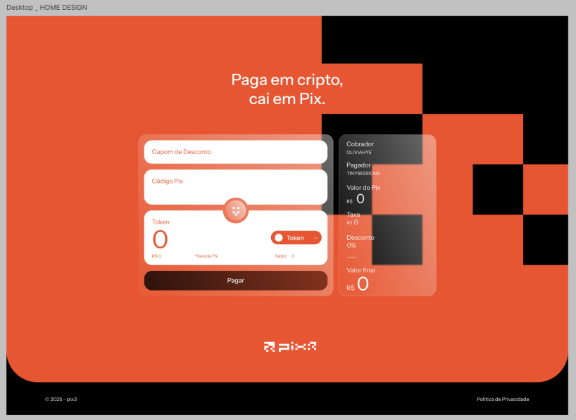

# pix3
serviço que permite a usuários Web3 realizar pagamentos de cobranças via PIX utilizando criptomoedas ou tokens.

###  Stack 
**Backend**  
Elixir · Phoenix · Oban · Rust · Node  

**Deploy e observabilidade**  
Docker - Jenkins  
Prometheus  

**URL em produção:** [pix3.gg](https://pix3.gg)
